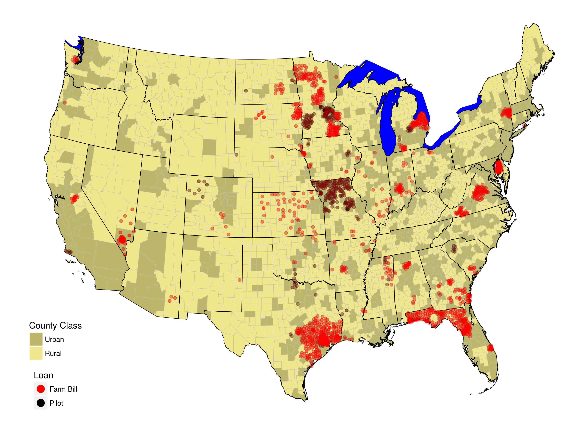

```{r, include=FALSE}
library(knitr)
opts_knit$set(root.dir = normalizePath(".."))
read_chunk("2-USDA_Evaluation_Figures.R")
```

```{r global_options, include=FALSE}
knitr::opts_chunk$set(echo=FALSE, warning=FALSE, message=FALSE, dev='png')
```

```{r load, include=FALSE}
<<Start>>
```

# Data Description
I have compiled the FCC form 477 data from December 1999 through June 2008 where reporting is at the zip code level with number of broadband providers. Data on broadband providers is measured twice a year (June 30 and December 31). The variable takes on a count value of 0, 1-3\*, 4, 5, 6, ... 31. The value 1-3\* is a suppressed value of broadband providers for confidentiality purposes and has been coded as 2 to be consistent with the literature. For visualization purposes, I have decided to assign the suppressed values using a random uniform number generator with values between 1 and 3.

## Zip Code Access
There is a clear diffusion of broadband access from the end of 1999 through 2008 when the FCC data changed format and cannot effectively be merged. The shape of the distribution at each point in time starts with a clear right skew, and slowly the meat of the distribution shifts rightward to catch up with the right-tail.

```{r Zip time}
<<Zip time>>
```

This time period is typically described as the diffusion of broadband, which follows the S-curve that most other technologies are familiar with. Adoptions references the use of a technology while the data are availability of broadband within a zip code. We can partially observe the S-curve by looking at the proportion of zip codes **without** broadband access across this time:

```{r Zip Downtake}
<<Zip Downtake>>
```

In one sense, these zip codes can be described as broadband adopters although this particular measure is of availability and not necessarily use of broadband. The [FCC did not track](https://transition.fcc.gov/wcb/iatd/comp.html) the percentage of subscribers to broadband in a geographical area [until the second half of 2008](https://www.fcc.gov/encyclopedia/form-477-census-tract-data-internet-access-services). At that time, the FCC also changed the reporting unit from zip code level data to census tract level data because the latter is a consistent polygon while the former may change across time.

## Rural-Urban Continuum Descriptions
```{r ruc, include=FALSE}
<<RUC>>
```
In the current sample of data, there are `r format(length(unique(RUC$fips)), big.mark = ",")` counties. Across all counties, [ERS has a classification system](http://www.ers.usda.gov/data-products/rural-urban-continuum-codes.aspx) for county types where they break counties down by:

|Code |	Description |
|:----|:------------|
|Metro counties:| |
|1 |	Counties in metro areas of 1 million population or more |
|2 |	Counties in metro areas of 250,000 to 1 million population |
|3 |	Counties in metro areas of fewer than 250,000 population |
| Nonmetro counties: | |
|4 |	Urban population of 20,000 or more, adjacent to a metro area |
|5 |	Urban population of 20,000 or more, **not** adjacent to a metro area |
|6 |	Urban population of 2,500 to 19,999, adjacent to a metro area |
|7 |	Urban population of 2,500 to 19,999, **not** adjacent to a metro area |
|8 |	Completely rural or less than 2,500 urban population, adjacent to a metro area |
|9 |	Completely rural or less than 2,500 urban population, **not** adjacent to a metro area |

These are grouped into three general categories: Metro (`r format(length(unique(filter(RUC, ruc == "metro")$fips)), big.mark = ",")`), Rural but adjacent to Metro (`r format(length(unique(filter(RUC, ruc == "adj")$fips)), big.mark = ",")`), and Rural but not adjacent to Metro (`r format(length(unique(filter(RUC, ruc == "nonadj")$fips)), big.mark = ",")`). Throughout the period of inspection, there has been what many people ascribe as a "Digital Divide" across these county classifications:

```{r RUC graph}
<<RUC graph>>
```

A similar story would be seen if we looked at broadband access instead of number of providers or if the zip codes were aggregated up to the county level.

## Loan Program
Around 2001, the USDA created what they considered a Pilot Program which aimed at providing broadband access to underserved areas. The program disbursed subsidized loans to companies with projects that expanded broadband services. The Pilot Program lasted about two years, after which the USDA decided to further expand the program in 2004 to what is termed the Current Program:

```{r Loan Time}
<<Loan Time>>
```


## Loan Program with Rural Emphasis

The loan disbursement across these classifications were intended more for Rural areas, although both the Pilot and Current had over 30\% of their loans directed towards Metro areas:

```{r}
RUC %>% 
  group_by(loantype) %>% 
  summarise(Metro = sprintf("%.1f %%", 100*sum(ruc == "metro") / n()),
            `Rural Adjacent` = sprintf("%.1f %%", 100*sum(ruc == "adj") / n()),
            `Rural Non-Adjacent` = sprintf("%.1f %%",
                                           100*sum(ruc == "nonadj") / n())) %>% 
  knitr::kable(caption = "County Class by Loan Type")
```

The broadband loan program was designed to give underserved and remote areas more access. The total number of zip codes in the sample is `r format(length(unique(RUC$zip)), big.mark = ",")`. Of these, `r length(unique(filter(RUC, loantype == "PILOT")$zip))` zip codes received Pilot loans and `r format(length(unique(filter(RUC, loantype == "CURRENT")$zip)), big.mark = ",")` received the Current loans. Further, 
To look at how the number of zip codes by county classification gained access over time:


```{r ruc tables}
<<RUC tables>>
```

### Zip Codes Stats
Although the targetted loan recipients were to be underserved areas, it is important to note other economic characteristics of the communities receiving these loans. For example, are the areas underserved because they also tend to have lower levels of economic output? To investigate this, we can use Zip Code Business Pattern data as a way to proxy economic activity. These data provide the total number of establishments in a zip code as well as the number of employees.

```{r Zip Attributes Graph}
<<Zip Attributes Graph>>
```

As you can see, the Pilot loan recipients tended to have lower levels of employment and establishments across the entire timeframe as compared to national averages. The Current program recipients appear to lag behind national averages initially and then increase above this across the period. I caution that the (bootstrapped) standard errors associated with the average level of employees and establishments would indicate that the Current recipients and National Averages are statistically indistinguishable. This is a good segway for a causal analysis in determining the effectiveness of both loan programs.

### County Stats
Zip code level data are hard to find, so to evaluate other economic factors that may have affected broadband diffusion and/or loan effectiveness we need to use county level statistics. I use IRS data to evaluate population, income, and wages. These are used because they reflect measurable economic activity. Population is proxied with number of exemptions by county. Income is proxied with total Adjusted Gross Income for a county divided by the number of households (proxied with returns). And wages utilize the reported wages earned by households.

```{r FIP Data, include=FALSE}
<<FIP Data>>
```
```{r FIP Attributes Graph}
<<FIP Attributes Graph>>
```

The (bootstrapped) standard errors indicate that Pilot, Current, and counties receiving no loans are statistically indistinguishable for population, income, and wages. It is still interesting to note that the Pilot program, on average, went to counties with higher level of population, income, and wages. This is very interesting, although we already saw that Pilot loans were underserved areas as noted through FCC data.

### Location of Loans
To close, here is a map of where all of the loans went:

