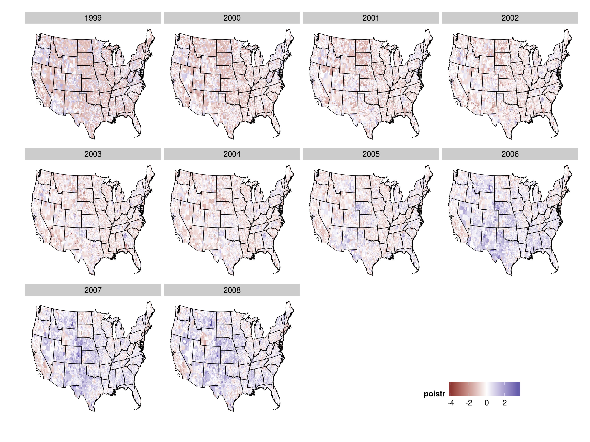
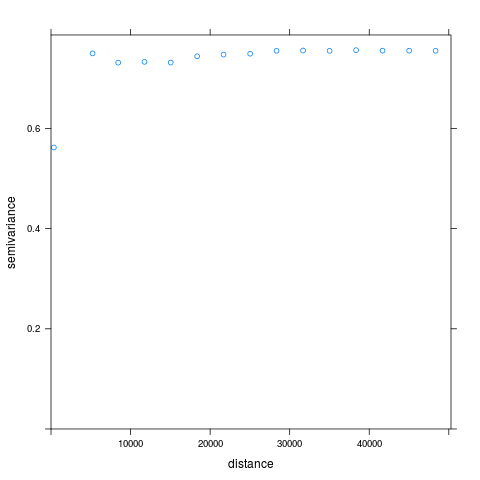
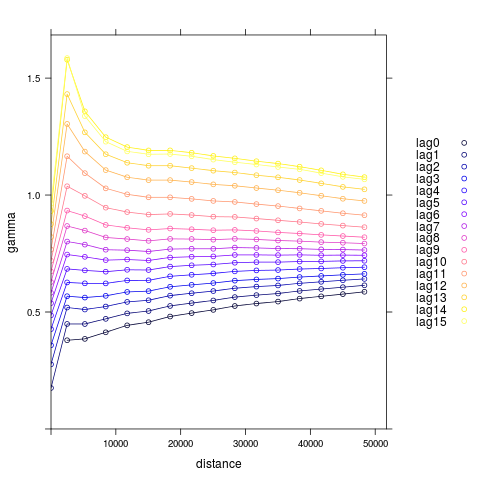
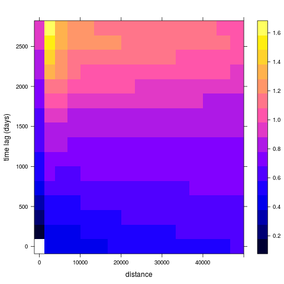

```{r, include=FALSE}
library(knitr)
opts_knit$set(root.dir = normalizePath(".."))
read_chunk("4-USDA_Evaluation_Poisson.R")
```

```{r global_options, include=FALSE}
knitr::opts_chunk$set(echo=FALSE, warning=FALSE, message=FALSE, dev='png')
```

```{r load, include=FALSE}
<<Start>>
```

# Poisson Panel Regressions for Broadband Availability

The following regressions make use of the `glm` function for generalized linear models in `R` in order to identify the relationship between broadband availability and the USDA Broadband Loan Program. Loosely, we wish to model the number of broadband providers by zip code across the years 1999 to 2008 and determine whether or not the USDA Broadband Loan Program had an impact on broadband availability as this was one of the intended benefits of the subsidized loans. As a quick reference, here is what the dependent variable looks like across time:

```{r}
library(ggplot2)
library(gridExtra)
hp <- ggplot(data, aes(x = Prov_hist)) + geom_histogram() + theme_minimal()
grid.arrange(hp + scale_x_discrete(breaks = c(5, 10, 15, 20, 25)) +
               labs(title = "Number of Providers (Pooled)", x= "", y = "Count"),
             hp + scale_x_discrete(breaks = c(5, 10, 15)) + facet_wrap(~ time) +
               coord_cartesian(xlim = c(0, 15)) +
               labs(title = "Across Time", x= "", y = ""),
             ncol = 2)
```

***Suppressed values were drawn from a uniform distribution between 1 and 3 for visual purposes.***

Data on broadband providers is measured twice a year (June 30 and December 31) and takes on a count value of 0, 1-3\*, 4, 5, 6, ... 31. The value 1-3\* is a suppressed value of broadband providers for confidentiality purposes and has been coded as 2 to be consistent with the literature. In the sample, the mean across all years for providers is `r format(mean(round(data$Prov_num)), digits = 2)` and a sample variance of `r format(var(round(data$Prov_num)), digits = 2)`. For a Poisson distribution, the mean and variance are restricted to be equal which indicates here that the unconditional distribution is not likely to be Poisson. This may be troublesome if the conditional mean and variance of the model differ by as much as the sample mean and variance. Therefore, Quasi-Poisson and Negative Binomial models are also considered (and likely to be the true process).

Other variables used include:

* `iloans` - an indicator variable for whether or not a zip code received a loan and the central focus. No loans were given before 2002, so this variable does vary by time. This can be borken down further to `ipilot` to indicate the smaller Pilot program which lasted from 2001 to 2003 and disbursed 28 loans totalling \$180 million as well as the Post-Pilot program, `ibip1234`, which was established by the 2002 Farm Bill. The Post-Pilot program began disbursing loans in 2003 and we have data until 2006 which totals \$1.22 billion across 70 loans.
* `log(est)` - this is from zip code business pattern data and is the number of establishments in a particular zip code. I take the log of this variable because the distribution is right-skewed. It is possible to substitute this variable with number of employees, annual payroll, or first quarter payroll from the ZBP but I choose not to because those variables are **suppressed for approximately `r paste0(format(sum(data$ap == 0) / sum(!is.na(data$ap))*100, digits = 2), "%")` of the zip codes**. Establishments is highly correlated with the other variables anyway, so I would rather use a less precise proxy than potentially bias the sample.
* `log(Pop_IRS)` - IRS has data on number of tax returns filed by county from 1989 until 2013. I use the number of exemptions per county as a way to proxy for the population of a county. This variable is also right-skewed and therefore the log of population is taken instead of population. The alternative for population would be to use US Census data which produce yearly estimates at the county level. These estimates are based off of the 2000 Census and use the demographic age distribution of a county in order to project forward the birth rate and death rate to determine what the population in a county should be. Since this is simply a function of initial conditions in 2000, I choose to use IRS data because there is more variation in the data and it reflects changes in economic conditions across counties that would drive migration (population change).
* `logINC` - this is tabulated from the same IRS data above using Adjusted Gross Income (AGI) at the county level for each year. This is divided by the number of households for a county and is therefore a proxy for mean income, as reported to the IRS, per year. Again, this is a right-skewed variable which is the justification for taking the logarithm of the variable.
* `tri` - stands for Terrain Ruggedness Index which uses elevation data for a given polygon to calculate the feature changes in a given area relative to the entire domain. This is at the ZCTA level across the United States and is thought of as a proxy for increased costs of broadband deployment due to rough terrain. This does not vary across years and so zip code fixed effects will take away this variable.
* `ruc` - the rural-urban continuum code, but for this study I simply use 3 classifications of a county: Metro, Rural but adjacent to a metro county, and Rural but non-adjacent to a metro county. Counties do change across time, but only in years that end in 3 (1993, 2003, ...). I choose to use the values for 2003 as this would be a little bit before the halfway point in the analysis.

## Poisson Regression Models

I start with by making use of the count nature of the broadband providers variable by assuming it follows a Poisson distribution:

$$ {Prov}_{z,t} | X_{z,t}, \beta \sim {Pois}  \left( \lambda_{z,t} \right)
$$
$$ log \left( \lambda_{z,t} \right) = \beta_0 + \beta_1 {Loan}_{z,t} + \beta_2 X_{z,t} + \tau_{t} + \varepsilon_{z,t}$$

The variable ${Prov}_{z,t}$ is the number of providers in zip code $z$ at time $t$. The $X_{z,t}$ are variables at the zip code or county level that determine the level of broadband providers. These are log of establishments, log of population, log of income, terrain ruggedness index, and rural: adjacent and non-adjacent. There is also a time fixed effect for each year included in these regressions. The biannual values for the provider numbers gives a panel dataset where T = `r length(unique(data$time))` and n = `r length(unique(data$zip))`.


### Biannual Regression

As a naive start to use of the Poisson distribution, I will start with two models: the first without time fixed effects and the second including these. An ANOVA test to determine whether the time fixed effects are jointly significant is performed at the bottom which provides evidence of time fixed effects as a significant predictor of broadband diffusion:

```{r Biannual}
<<Biannual>>
```

The associated coefficients appear to jive with expectations. There is a positive association with establishments, population, income, and metro setting. Further, tri and rural areas (non-adjacent even moreso) are associated with lower levels of broadband access. However, because the functional form of the model is non-linear I hold off on interpretation of the effects. The main point to take-away here is that the loans are not significant. To check if this is a suitable fit of a model, I turn to a histogram of fitted values and Q-Q plot for the model with time fixed effects:

```{r}
par(mfrow = c(1, 2)) # Changing PLOT SETTINGS
hist(fitted(poist), main = "Histogram of Fitted Values", xlab = "Predicted Values")
qqnorm(residuals(poist, type="deviance"))
qqline(residuals(poist, type="deviance"), col = 2, lwd = 2, lty = 2)
```

Visual inspection of the fit indicates use of a count model is superior to the previous panel regression. The range of the fitted values matches that of our observed and appears to maintain a similar shape. These are far superior to any of the linear or dynamic panel methods previously used. I take this as strong evidence that a count model should be used here as opposed to a least squares panel methods.

Alternatively, I did run a regression with a time trend instead of a time fixed effect, but the model fit was worse via AIC and adjusted R-Squared.

## (Quasi-)Poisson and Negative Binomial

To further inspect this relationship, two other models are considered to account for the potential overdispersion of observed variance: Quasipoisson and Negative Binomial. 

```{r Quasi}
<<Quasi>>
```

There is some problem that I cannot figure out with the Negative Binomial model as it gives identical results to the Poisson Model. Effectively, the Negative Binomial model is fit via maximum likelihood methods and the numerical algorithm does not converge. I do not know what is causing this, although the Negative Binomial model will converge if I remove time fixed effects. I err on the side of avoiding the Negative Binomial as opposed to dropping the time fixed effects.

As for the Quasi-Poisson Model, the only difference appears to be that the standard errors are smaller. The coefficients across all models are identical, which also results in residuals being identical across all models.

## Residuals

We can turn to inspection of time, space, and space-time correlation in residuals to determine the fit of our model and that assumptions are satisfied. First, the correlation structure of residuals across time:

```{r Residuals}
<<Residuals>>
```

*(I have averaged the residuals by year across time so that the correlation structure can be visible.)*

One can observe that there is a pattern where the correlation across all observations each year have a higher correlation to the closer years than further away. So there is evidence of serial correlation, although it is unclear how to proceed because this is a relatively short panel compared to the number of observations. Fitting an autoregressive (AR) or moving average (MA) process for each zip code would introduce a large number of parameters and I begin to wonder if the cure is worse than the disease in this scenario.

The typical applied remedy is to simply use robust standard errors in significance testing. The `vcovHAC` function in `R` allows for heteroskedastic and autocorrelation consistent covariance matrix estimation. Applying this to our previous models would yield different standard errors, but the point estimates would remain the same. Seeing that the Poisson, Quasi-Poisson, and Negative Binomial resulted in the same coefficients, we can use the `vccovHAC` function on the Poisson regression to observe this effect. Unfortunately, as I have attempted to run this in `R` I have not been able to get the function to work. The model must be too large for my computer to handle, so instead I will present the `vcovHC` results though which are the White standard errors:

```{r vcovHC}
library(sandwich)
library(lmtest)
coeftest(poist, function(x) vcovHC(x, type = "HC0"))
```

This is slightly puzzling that the White standard errors are generally smaller than the other models. This gives me pause as to how to approach the calculation of standard errors in this setting ... but onto the spatial effects.

## Spatial Effects
As I have mentioned before, the diffusion process of broadband is decidedly spatial from an engineering perspective. For an area to receive broadband access, various hubs-cables-lines need to be built. This is not unlike electrification, telephones, and highways. So as a quick check to see if this is an actual problem would be through some maps:



Does there appear to be spatial clustering of residuals? Well, it is possible but my eyesight is not the best. A more sophisticated way to evaluate the potential for spatial autocorrelation is through the use of an empircal variogram. A variogram is defined as the variance of the difference between field values at two locations across realizations of the field (Cressie 1993). There are theoretical variograms that describe a spatial process via parameters which can be estimated, however before getting to that step it is best to look at the empirical variogram which is defined as:

$$ \gamma \left( h \right) = Var \left( Y \left( s + h \right) - Y \left( s \right) \right) $$

where $s$ denotes the location of a spatial process (usually with longitude and latitude) and $h$ is the difference between two locations. This is the analogue to a partial autocorrelation function in the time series methods, except a variogram is the inverse of the partial autocorrelation. A typical empirical variogram of a spatial process will start with a low value on the variogram (indicating high correlation) and then increase up to a particular value given a distance and then appear to be flat from there on. If this happens, then it indicates that closer values are closely related while further away values are not as related.

Here is the pooled empirical variogram where time is ignored and the residuals of the Poisson model are clumped together and then the distance between are binned up and plotted:



Huh. Well the distance here is in terms of meters and it doesn't appear that there is any pattern in the residuals due to distance from others. The semivariance appears to be fairly constant across all distances, which would make fitting a spatial model pointless. But it might be the case that the temporal autocorrelation is masking the spatial effects. In order to evalute this, we can compile an empirical spatio-temporal variogram. A three dimensional variogram so to speak:





OK at this point it seems like going down the path of modeling the diffusion of broadband providers via spatio-temporal methods is one that does not bear much benefit. This may also provide insight into why I have not been able to estimate any meaningful spatial model to this data.